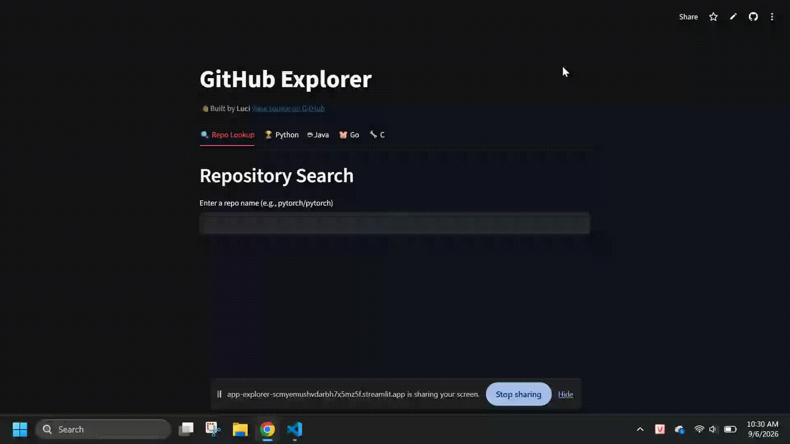

# GitHub Explorer

A Streamlit web app for exploring GitHub repositories — look up any repo by name, or browse the top 10 most-starred repositories across Python, Java, Go, and C.

Built as a portfolio project extending Chapter 17 (_Working with APIs_) of **Python Crash Course** — turned from a terminal script that generated a static SVG chart into a deployed, interactive web app.

🔗 **Live demo:** [https://app-explorer-scmyemushvdarbh7x5mz5f.streamlit.app]

## Features

- **Repo Lookup tab** — enter any `owner/repo` name (e.g. `pytorch/pytorch`) and see its stars, forks, open issues, language, and a link to GitHub.
- **Language tabs** (Python / Java / Go / C) — fetch and chart the top 10 most-starred repositories for each language, with:
  - An interactive Plotly bar chart with hover tooltips showing each repo's description
  - A clickable list of links below the chart to jump straight to GitHub
- **Error handling** for common real-world API failures: rate limits (403), missing repos (404), network timeouts, and connection errors — with friendly messages instead of raw tracebacks.
- **Loading spinners** while data is being fetched from the GitHub API.

## Sample Output



```
Top 10 Python Repositories by Stars
[bar chart: repo names on x-axis, star counts on y-axis]
Hovering a bar shows: <repo name> | Stars: <count> | <description>
```

## Libraries & Files

| File               | Purpose                                                 |
| ------------------ | ------------------------------------------------------- |
| `app.py`           | Main Streamlit app — UI layout, tabs, and API calls     |
| `requirements.txt` | Dependencies for deployment (Streamlit Community Cloud) |

| Library                                        | Used for                                        |
| ---------------------------------------------- | ----------------------------------------------- |
| [`streamlit`](https://streamlit.io/)           | Web app framework — UI, tabs, buttons, spinners |
| [`requests`](https://requests.readthedocs.io/) | Calling the GitHub REST API                     |
| [`plotly`](https://plotly.com/python/)         | Interactive bar charts with hover tooltips      |

## How It Works

1. `get_repos_by_language(language)` and `get_single_repo(repo_name)` call the [GitHub Search API](https://docs.github.com/en/rest/search) and [Repos API](https://docs.github.com/en/rest/repos) respectively.
2. `render_language_tab(language, display_name)` is a single reusable function that powers all four language tabs — each tab just calls it with a different language code, avoiding duplicated code across tabs.
3. Every API call is wrapped in error handling for:
   - `403` — GitHub API rate limit exceeded
   - `404` — repository not found (Repo Lookup tab only)
   - Any other non-200 status code
   - Request timeouts and network/connection errors
4. Chart data (names, stars, descriptions, links) is prepared as parallel lists, then passed to Plotly (`px.bar`) with a custom `hovertemplate` to show descriptions on hover.

## Running Locally

```bash
pip install -r requirements.txt
streamlit run app.py
```

## Beyond the Book

The book's version of this project (Chapter 17) was a terminal script that made one API call and rendered a static Pygal SVG chart to a file. This version goes further:

- Turned the script into an interactive **Streamlit web app** deployable with a public link
- Replaced Pygal with **Plotly** for interactive, hoverable charts
- Added a **repo lookup** feature beyond the book's single "top 10" chart
- Extended to **multiple languages** via a single reusable function instead of duplicating chart logic
- Added **real-world error handling** (rate limits, 404s, timeouts, network errors) and loading spinners — none of which the original script handled
- **Deployed live** on Streamlit Community Cloud, rather than only running locally

## What I Learned

- How Streamlit's execution model works: the whole script reruns top-to-bottom on every interaction, and widgets like `st.button` only return `True` for the run immediately after they're clicked
- Why `key=` is required on widgets that are created inside a function called multiple times (e.g. one button per tab) to avoid `DuplicateWidgetID` errors
- How to structure `try/except` blocks so a more specific exception (`Timeout`) is caught before its more general parent (`RequestException`) — Python checks `except` blocks in order
- Why checking `response.status_code` before parsing JSON is safer than waiting for a `KeyError` to happen
- How to attach extra data to a Plotly chart (`customdata`) to build custom hover tooltips
- The trade-off between quick copy-paste duplication and refactoring into a reusable function — and why the second pays off once you need 3+ similar tabs
- External API data is often "dirty" (missing fields, nulls, unexpected formats) and needs a cleanup step before hitting the UI — this is why the app builds a separate `desc_texts` list (with `None` descriptions replaced by `"No description"`) instead of using the raw `descriptions` list directly, ensuring the tooltip and the link list below the chart always stay in sync and never show "None"
